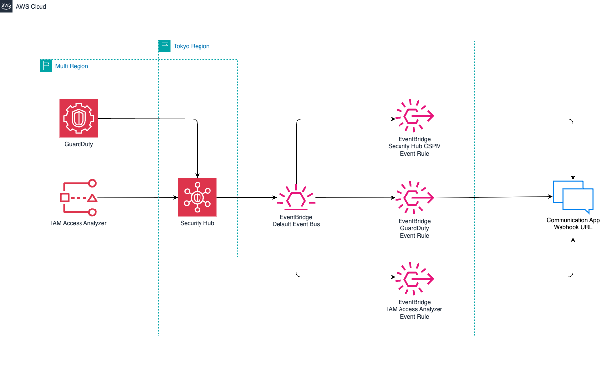

# terraform-notify-aws-security-service

AWS Security Services (Security Hub CSPM, GuardDuty, IAM Access Analyzer) のアラートをコミュニケーションアプリに通知する Terraform コードです。

## アーキテクチャ

## 概要

このモジュールは以下のセキュリティサービスからのアラートを EventBridge 経由で Webhook URL に通知します。

- **Security Hub CSPM** - Security Hub のセキュリティ基準チェック結果
- **GuardDuty** - 脅威検出結果
- **IAM Access Analyzer** - IAM ポリシー分析結果

各サービスからのアラートは Security Hub に集約され、EventBridge Rule でフィルタリングされた後、API Destination を経由してチャットアプリに通知されます。

## 前提条件

- Terraform >= 1.0
- AWS Provider
- 通知先のコミュニケーションアプリで発行した Webhook URL
- 使用するAWS Securityサービス(Security Hub CSPM, GuardDuty, IAM Access Analyzer)のいずれかが有効化され、Security Hubに集約されている事

## 入力変数

| 変数名 | 説明 | 型 | 必須 | デフォルト |
|--------|------|-----|------|------------|
| `system_prefix` | リソース命名用のシステムプレフィックス | `string` | Yes | - |
| `env_prefix` | リソース命名用の環境プレフィックス | `string` | Yes | - |
| `webhook_url` | 通知先のコミュニケーションアプリで発行した Webhook URL | `string` | Yes | - |
| `mentioned_user_mail_address` | メンション対象ユーザーのメールアドレス (例: xxx@example.com) | `string` | Yes | - |
| `mentioned_user_name` | メンション対象ユーザーの表示名 | `string` | Yes | - |
| `securityhub_cspm_severity_labels` | Security Hub CSPM の通知対象重大度リスト (CRITICAL/HIGH/MEDIUM/LOW/INFORMATIONAL)。空リストで通知無効化。 | `list(string)` | No | `["HIGH", "CRITICAL"]` |
| `guardduty_severity_labels` | GuardDuty の通知対象重大度リスト (CRITICAL/HIGH/MEDIUM/LOW/INFORMATIONAL)。空リストで通知無効化。 | `list(string)` | No | `["HIGH", "CRITICAL"]` |
| `iam_access_analyzer_severity_labels` | IAM Access Analyzer の通知対象重大度リスト (CRITICAL/HIGH/MEDIUM/LOW/INFORMATIONAL)。空リストで通知無効化。 | `list(string)` | No | `["HIGH", "CRITICAL"]` |

## 出力値

| 出力名 | 説明 |
|--------|------|
| `events_api_destination_arn` | EventBridge API Destination の ARN |
